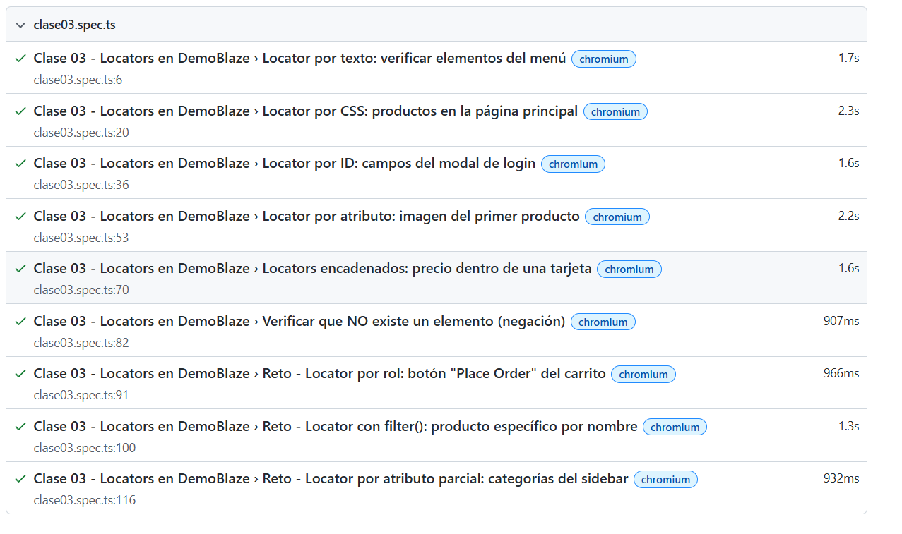

# Guía paso a paso: Setup de Playwright con TypeScript

Curso 048 · Aseguramiento de la Calidad del Software · Clase 1
Esta guía reproduce desde cero el proyecto de este repositorio: pruebas end-to-end con Playwright + TypeScript sobre [DemoBlaze](https://www.demoblaze.com).

---

## 0. Requisitos previos

Instala esto antes de empezar:

| Herramienta | Dónde descargar |
|---|---|
| Node.js v18 o superior | https://nodejs.org |
| Visual Studio Code | https://code.visualstudio.com |
| Git | https://git-scm.com |
| Extensión "Playwright Test for VSCode" | ID: `ms-playwright.playwright` (buscar en el marketplace de VS Code) |

Verifica que Node quedó instalado, desde la terminal integrada de VS Code (menú **Terminal ▸ New Terminal**, o `Ctrl + ñ`):

```powershell
node --version
npm --version
```

Todos los comandos de esta guía funcionan igual en PowerShell y en CMD.

---

## 1. Crear el proyecto

```powershell
mkdir qa-playwright-curso
cd qa-playwright-curso
npm config set ignore-scripts true --location=project
npm init playwright@latest
```

El asistente de Playwright te va a preguntar:

- **Lenguaje:** TypeScript
- **Carpeta de tests:** `tests`
- **¿Agregar GitHub Actions?:** No
- **¿Instalar navegadores?:** No (los instalamos aparte en el paso 3)

### ¿Qué hace `npm config set ignore-scripts true`?

Crea un archivo `.npmrc` con la línea:

```
ignore-scripts=true
```

Esto es una medida de seguridad: cuando corres `npm install`, los paquetes pueden ejecutar scripts automáticos (`postinstall`), que son un vector de ataque de **cadena de suministro** (una dependencia comprometida podría ejecutar código en tu máquina sin que lo apruebes). Con `ignore-scripts=true`, esos scripts quedan bloqueados y solo corre lo que tú ejecutas conscientemente — como el siguiente paso.

---

## 2. Instalar los navegadores

Como bloqueamos los scripts automáticos, hay que descargar los navegadores de Playwright a mano:

```powershell
npx playwright install
```

---

## 3. Configurar el proyecto

Reemplaza el contenido de **`playwright.config.ts`** por:

```ts
import { defineConfig, devices } from '@playwright/test';

export default defineConfig({
  testDir: './tests',
  timeout: 30000,
  reporter: [['list'], ['html', { open: 'never' }]],
  use: {
    baseURL: 'https://www.demoblaze.com',
    headless: false,
    screenshot: 'only-on-failure',
    video: 'retain-on-failure',
  },
  projects: [{ name: 'chromium', use: { ...devices['Desktop Chrome'] } }],
});
```

- `baseURL` permite navegar con rutas relativas: `page.goto('/')`.
- `headless: false` abre el navegador visible mientras corren los tests (usa `true` cuando lo automatices en CI/CD).
- `screenshot` y `video` solo se generan cuando un test falla.

Y **`tsconfig.json`**:

```json
{
  "compilerOptions": {
    "target": "ES2020",
    "module": "commonjs",
    "strict": true,
    "esModuleInterop": true,
    "skipLibCheck": true
  },
  "include": ["tests/**/*.ts"]
}
```

---

## 4. Escribir el primer test

Elimina `tests/example.spec.ts` (lo genera Playwright por defecto) y crea **`tests/clase01.spec.ts`**:

```ts
import { test, expect } from '@playwright/test';

test('La página carga', async ({ page }) => {
  await page.goto('/');
  await expect(page).toHaveTitle(/STORE/);
  await expect(page.locator('#navbarExample')).toBeVisible();
});

test('El menú de categorías es visible', async ({ page }) => {
  await page.goto('/');
  await expect(page.locator('#cat')).toBeVisible();
});

test('La barra de navegación tiene los enlaces', async ({ page }) => {
  await page.goto('/');
  const nav = page.locator('#navbarExample');
  await expect(nav.getByRole('link', { name: 'Home' })).toBeVisible();
  await expect(nav.getByRole('link', { name: 'Contact' })).toBeVisible();
  await expect(nav.getByRole('link', { name: 'About us' })).toBeVisible();
  await expect(nav.getByRole('link', { name: 'Cart' })).toBeVisible();
  await expect(nav.getByRole('link', { name: 'Log in' })).toBeVisible();
  await expect(nav.getByRole('link', { name: 'Sign up' })).toBeVisible();
});
```

---

## 5. Ejecutar los tests

```powershell
# Ejecutar todos los tests
npx playwright test

# Ver el reporte HTML (abre http://localhost:9323, Ctrl+C para cerrar)
npx playwright show-report

# Modo visual interactivo (corres los tests con clic, no se ejecutan solos)
npx playwright test --ui
```

En la terminal vas a ver cuántos tests pasaron (✓), cuántos fallaron (✘) y el tiempo de ejecución.

---

## 6. Reto: hacer fallar un test a propósito

Cambia en `tests/clase01.spec.ts` el texto esperado, por ejemplo `/STORE/` por `/TIENDA/`, y vuelve a correr `npx playwright test`. Observa:

1. **Qué información da Playwright cuando falla**: te muestra el valor esperado vs. el recibido, el archivo y la línea exacta.
2. **Dónde queda el screenshot del fallo**: en `test-results/`, y también embebido en el reporte HTML (`npx playwright show-report`).
3. **`headless: false` vs `headless: true`**: con `false` ves el navegador abrirse y actuar en tiempo real (útil para depurar); con `true` corre en segundo plano sin interfaz (más rápido, ideal para CI/CD).

No olvides revertir el cambio antes de entregar.

---

## 7. Preparar el entregable

### 7.1 Crear el README.md

Debe incluir:

- Tu nombre completo y carné
- La versión de Node.js (`node --version`)
- Un screenshot de los tests pasando

Para el screenshot, corre los tests y luego abre el reporte:

```powershell
npx playwright test
npx playwright show-report
```

Toma una captura de pantalla de esa página (o de la terminal mostrando "3 passed") y guárdala en `docs/tests-passing.png`. En el README, insértala con **rutas separadas por `/`** (no `\`) y **sin espacios** en el nombre del archivo — GitHub no renderiza imágenes con backslashes de Windows:

```markdown

```

### 7.2 Subir a GitHub

```powershell
git init
git add -A
git commit -m "Clase 1: setup de Playwright con TypeScript y tests de DemoBlaze"
git branch -M main
git remote add origin https://github.com/<tu-usuario>/<tu-repo>.git
git push -u origin main
```

### 7.3 Entregar

Publica el enlace de tu repositorio en Canvas **antes de que termine la clase**. Valor: 1 pt.

---

## Resumen de comandos

| Comando | Qué hace |
|---|---|
| `node --version` · `npm --version` | Verifica Node y npm |
| `npm config set ignore-scripts true --location=project` | Crea `.npmrc` (seguridad) |
| `npm init playwright@latest` | Inicializa el proyecto |
| `npx playwright install` | Descarga los navegadores |
| `npx playwright test` | Ejecuta los tests |
| `npx playwright test --ui` | Modo visual interactivo |
| `npx playwright show-report` | Abre el reporte HTML |
| `git init && git add -A && git commit -m "..."` | Primer commit |
| `git remote add origin <url> && git push -u origin main` | Subir a GitHub |

**Próxima clase:** Clase 2 — Navegación, esperas y capturas.
